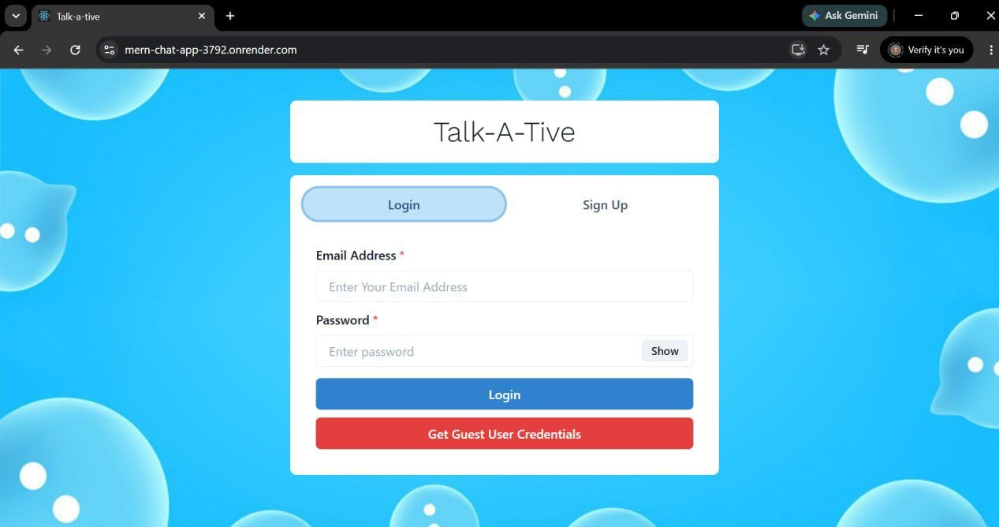
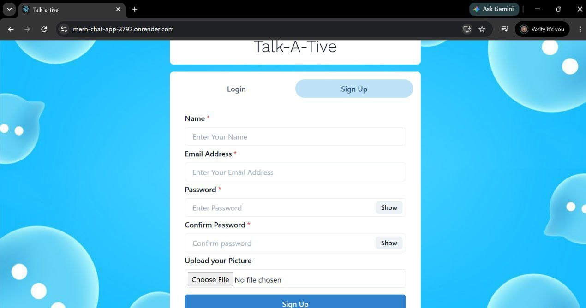
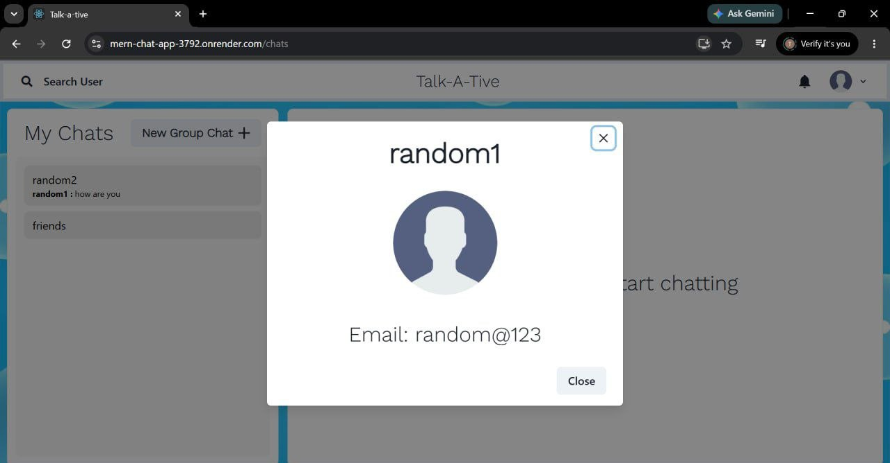
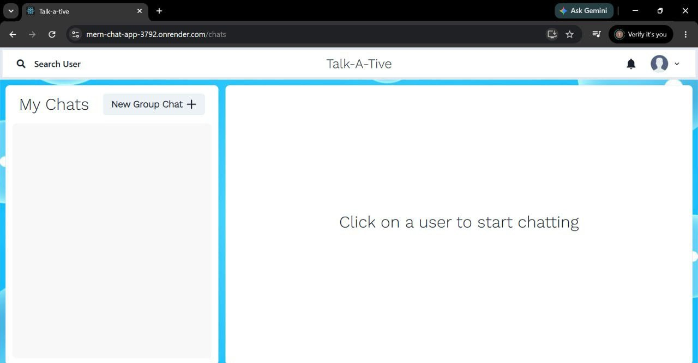
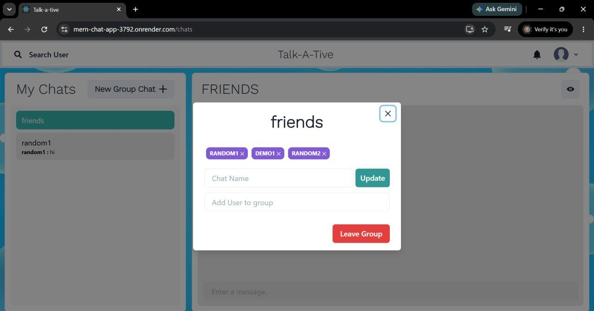
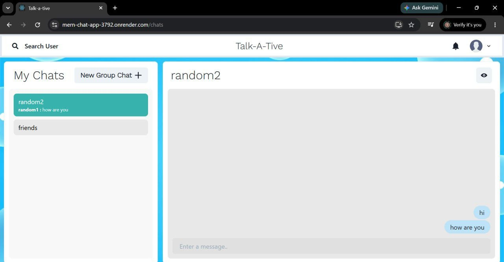
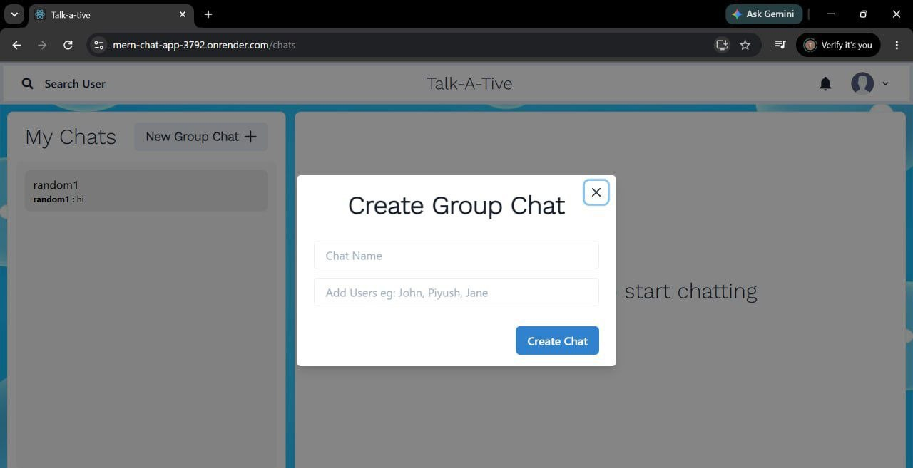
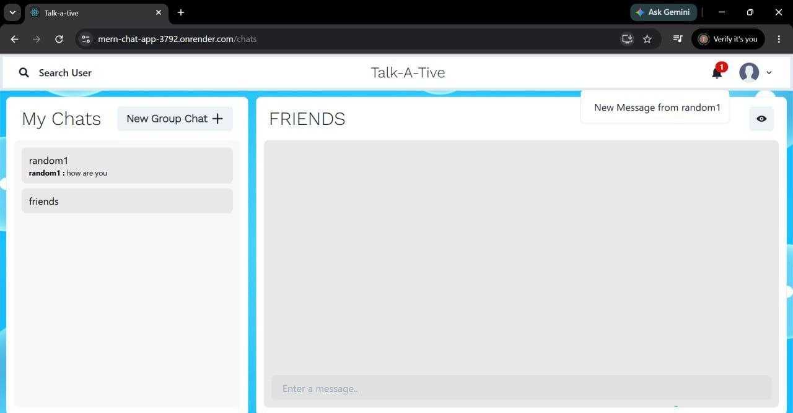
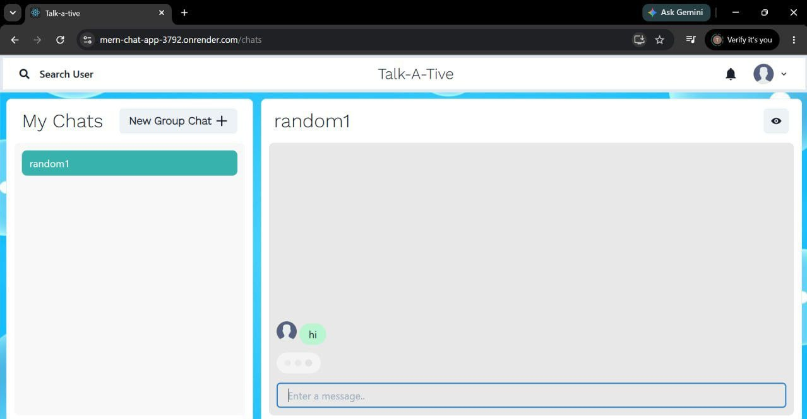

# 💬 Real-Time Chat Application

A full-stack real-time chat application built using the **MERN Stack**, **Socket.io**, and **Chakra UI**. The application enables users to communicate instantly through one-to-one and group chats with real-time message delivery, typing indicators, notifications, and secure JWT authentication.

---

# 🚀 Features

## 🔐 Authentication & Security

* User Registration
* User Login
* JWT Authentication
* Password Encryption using bcrypt.js
* Protected Routes
* Secure User Sessions

## 💬 Real-Time Messaging

* One-to-One Chat
* Group Chat
* Instant Message Delivery
* Real-Time Updates using Socket.io
* Typing Indicators
* Message Notifications

## 👥 Group Management

* Create Group Chats
* Rename Groups
* Add Members to Groups
* Remove Members from Groups
* Group Administration

## 🔍 User Search

* Search Registered Users
* Start New Conversations
* Manage Active Chats

## 🎨 User Interface

* Modern UI built with Chakra UI
* Responsive Design
* Mobile-Friendly Layout
* Clean and Intuitive User Experience

---

# 🛠️ Tech Stack

## Frontend

* React.js
* Chakra UI
* Axios

## Backend

* Node.js
* Express.js

## Database

* MongoDB
* Mongoose

## Real-Time Communication

* Socket.io
* WebSockets

## Authentication

* JSON Web Tokens (JWT)
* bcrypt.js

---

# 📂 Project Structure

```text
realtime-chat-mern/
│
├── client/
│   ├── build/
│   ├── public/
│   ├── src/
│   ├── package.json
│   └── package-lock.json
│
├── server/
│   ├── config/
│   ├── controllers/
│   ├── data/
│   ├── middleware/
│   ├── models/
│   ├── routes/
│   ├── .env
│   └── server.js
│
├── package.json
├── package-lock.json
└── README.md
```


# 📸 Screenshots

## 🔐 Login & Registration





## 👤 Profile Photo




## 🏠 App Dashboard




## 👥 Edit Group Chat Members



## 💬 One-to-One Chat




## 👥 Group Chat



## 🔔 Notifications



## ⌨️ Typing Indicator




# ⚙️ Installation

## Clone the Repository

```bash
git clone https://github.com/parth0811/mern-chat-app.git
```

## Navigate to the Project Directory

```bash
cd realtime-chat-mern
```

## Install Root Dependencies

```bash
npm install
```

## Install Backend Dependencies

```bash
cd server
npm install
```

## Install Frontend Dependencies

```bash
cd ../client
npm install
```

---

# 🔧 Environment Variables

Create a `.env` file inside the `server` directory:

```env
PORT=5000
MONGO_URI=YOUR_MONGODB_CONNECTION_STRING
JWT_SECRET=YOUR_SECRET_KEY
NODE_ENV=development
```

---

# ▶️ Running the Application

## Start Backend Server

```bash
cd server
npm start
```

## Start Frontend

```bash
cd client
npm start
```

Open:

```text
http://localhost:5000
```

---

# 🔄 Real-Time Communication Flow

1. User logs in using JWT authentication.
2. Socket.io establishes a persistent connection.
3. Users can send and receive messages instantly.
4. Group messages are broadcast to all members.
5. Typing indicators update in real time.
6. Notifications alert users to new messages.

---

# 📚 Concepts Practiced

* MERN Stack Development
* REST API Design
* MongoDB Data Modeling
* Authentication & Authorization
* JWT Security
* Password Hashing
* Socket.io Integration
* WebSocket Communication
* Real-Time Event Handling
* State Management
* Responsive UI Design
* Client-Server Architecture

---

# 🔮 Future Improvements

* Online / Offline Status
* Read Receipts
* File & Image Sharing
* Voice Messages
* Video Calling
* End-to-End Encryption
* Message Reactions
* Message Editing & Deletion
* Chat Themes & Personalization

---

# 👨‍💻 Author

**Parth Girdhar**

* MERN Stack Developer
* Full Stack Web Developer
* Real-Time Application Developer

LinkedIn:
https://www.linkedin.com/in/parth-girdhar0811/

---

# 📜 License

This project is licensed under the MIT License.